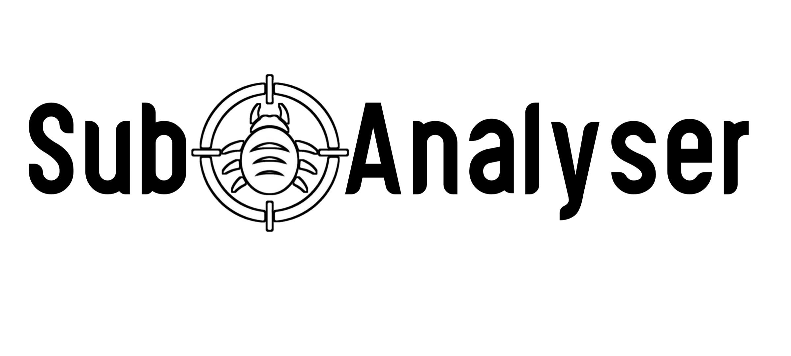
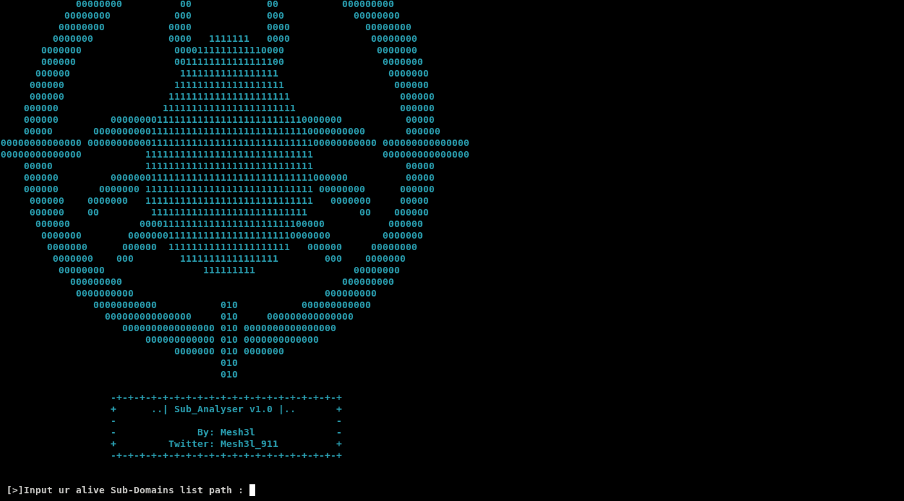
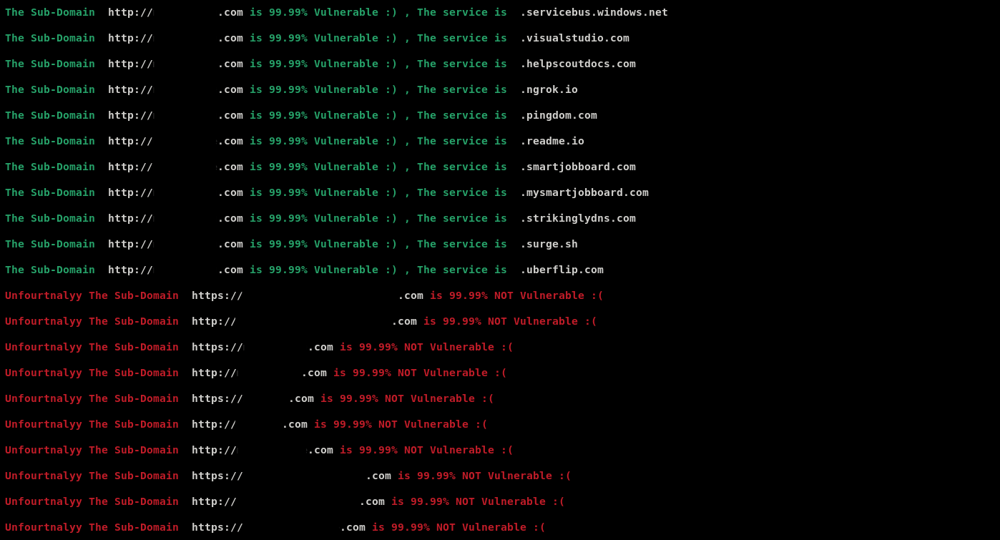
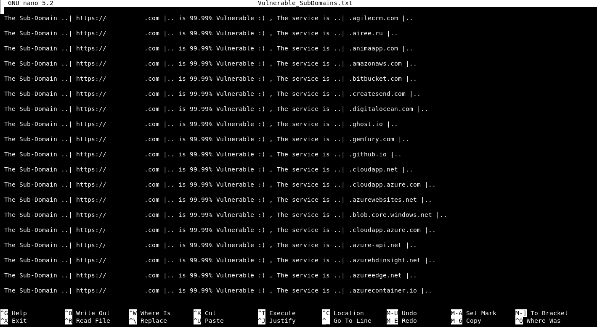
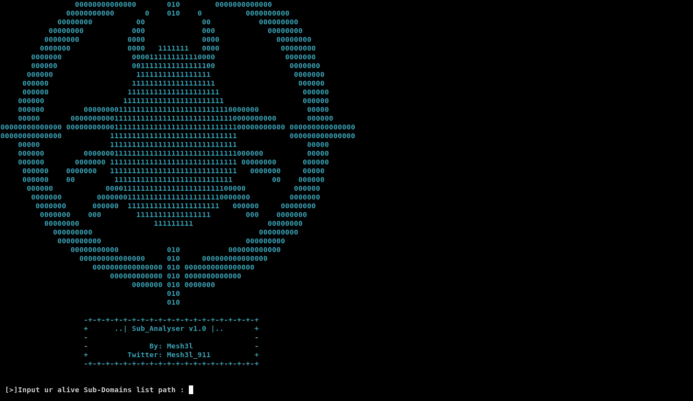

   
 

# Sub_Analyser v1.0 :

 <b>It's a tool that automates the process of testing websites against Sub-Domain TakeOver vulnerabilities.It's provided with 36 different services from @EdOverflow repo [ can-i-take-over-xyz ] and others that I've collected throughout my own experience ^_^  </b>
 

# Installation : 
 <code>git clone https://github.com/Mesh3l911/Sub_Analyser.git</code>
 

# Requirements :
 
<code>pip install -r requirements.txt</code>
 

# Usage :
 
<b>1-Collect alive SubDomains by ur own way</b> 
<b>2-Fire up the script   <code>python3 Sub_Analyser.py</code> 
  
 3- Write ur alive sub domains list path   
4- The output ( Vulnerable sub-domains ) will be saved in a txt file called (Vulnerable_SubDomains.txt)</b>  

    
<b> Full output </b>
    
<b> Output's Report </b> 
    
<b>Vulnerable_SubDomains.txt</b>
    
<b>Demo</b>
   

 

# P.s :
<b>This is the 1st version of this tool. We can all improve it together and I'll tell you how :  
I've collected 36 different services so what we can do is collecting more and more services 
when ever you face a new service that you could TakOver any of its subdomain and you would like to share it with the community you can DM me in twitter @Mesh3l_911 
and give me the name of that service so that I add it up to the list of the next vesrion INSHAALLAH ^_^</b>

 

# Happy Hunting ^_^ :
